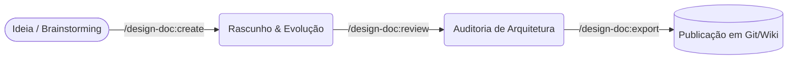

# Dede Agent (Design Docs)


*🇺🇸 [Read this in English](README-en.md)*

Conheça o **Dede: O Assistente de Design Docs**. Dede é um agente open-source do ecossistema Antigravity para criação, revisão e governança de Technical Design Docs. Ele impõe padrões arquiteturais, suporta templates dinâmicos e integra-se universalmente às suas skills de descoberta.

## 🧠 Por que Design Docs? (E o Ciclo de Vida)

Escrever um Design Doc (RFC) é a forma mais barata de errar no desenvolvimento de software. Ele alinha as expectativas dos stakeholders, previne falhas graves de arquitetura (como escolhas erradas de banco de dados ou nuvem feitas tardiamente) e elimina ruídos de comunicação antes que a primeira linha de código seja escrita.

**Referências Recomendadas:**

- [How to write a good software design document](https://blog.pragmaticengineer.com/software-architecture-is-overrated/) (The Pragmatic Engineer / Gergely Orosz)
- [Design Docs at Google](https://sre.google/sre-book/software-engineering-in-sre/) (Software Engineering at Google)

### O Fluxo de Trabalho do Dede



- **`/design-doc:create`**: Extrai o contexto de PRDs ou sessões de ideação (brainstorms) e gera o primeiro rascunho técnico baseado no template da sua empresa.
- **`/design-doc:review`**: Inspeciona um design doc existente e aplica uma auditoria rígida baseada nas regras globais de governança e segurança.
- **`/design-doc:export`**: Publica o documento aprovado em plataformas externas (Notion, Confluence, repositórios Git) injetando um Source Map bidirecional via Base64.

## 🛠️ Customização: Bring Your Own Template (BYOT)

Você pode sobrescrever os templates padrões e definir perfis customizados criando um arquivo `.agents/dede.yaml` na raiz do seu projeto:

```yaml
profile: "ai_genai"
template_path: "./docs/templates/meu_template_corporativo.md"
language: "pt-BR"
```

## 🔌 Interoperabilidade Universal

O Dede foi desenhado para agir como uma **Fonte Única de Verdade (SSOT)** para governança arquitetural. Você pode consumir as regras dele (`rules/AGENTS.md`) nas suas ferramentas de IA favoritas sem precisar duplicar arquivos.

### GitHub Copilot CLI (Terminal)

Você pode injetar a governança do Dede direto no seu prompt criando um alias no `~/.bashrc` ou `~/.zshrc`:

```bash
alias dede="gh copilot suggest -t shell 'Gere um technical design doc lendo rigorosamente as regras do arquivo ~/.gemini/config/plugins/dede-agent/rules/AGENTS.md'"
```

### GitHub Copilot (IDE)

Para forçar as regras do Dede em todo o seu time via Copilot no editor, crie um arquivo `.github/copilot-instructions.md` no seu projeto:

```markdown
# Arquitetura
Consulte sempre as diretrizes globais de governança e diagramas C4 em:
`~/.gemini/config/plugins/dede-agent/rules/AGENTS.md`
```

### Cursor & Claude

Basta copiar ou incluir o conteúdo de `rules/AGENTS.md` no `.cursorrules` ou `CLAUDE.md` do seu projeto local.

---
*Distribuído sob a licença MIT.*
