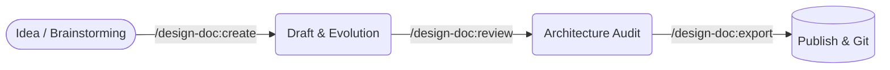

# Dede Agent (Design Docs)


*🇧🇷 [Leia em Português](README-pt.md)*

Meet **Dede: The Design Doc Assistant**. Dede is an open-source Antigravity agent for creating, reviewing, and governing Technical Design Docs. He enforces architecture standards, supports dynamic templates, and provides universal handoff from discovery skills.

## 🧠 Why Design Docs? (And the Lifecycle)

Writing a Design Doc (or RFC) is the cheapest way to make mistakes. It aligns stakeholders, prevents architectural bottlenecks (such as late database or cloud provider changes), and removes communication noise before a single line of code is written.

**Recommended Reading:**

- [How to write a good software design document](https://blog.pragmaticengineer.com/software-architecture-is-overrated/) (The Pragmatic Engineer)
- [Design Docs at Google](https://sre.google/sre-book/software-engineering-in-sre/) (Google SWE)

### The Dede Workflow



- **`/design-doc:create`**: Extracts context from PRDs or brainstorms and generates the initial technical design doc based on corporate templates.
- **`/design-doc:review`**: Audits the existing design doc against global architecture and security rules.
- **`/design-doc:export`**: Publishes the approved document to external platforms (Notion, Confluence, Git) using a bidirectional Base64 Source Map.

## 🛠️ Customization: Bring Your Own Template (BYOT)

You can override the default templates and define custom project profiles by creating a `.agents/dede.yaml` file in the root of your project:

```yaml
profile: "ai_genai"
template_path: "./docs/templates/my_corporate_template.md"
language: "en-US"
```

## 🔌 Universal Interoperability

Dede is designed to act as a **Single Source of Truth** for architectural governance. You can consume his rules (`rules/AGENTS.md`) in your favorite AI tools without duplicating configurations.

### GitHub Copilot CLI (Terminal)

You can inject Dede's governance directly into your terminal prompts by creating an alias in your `~/.bashrc` or `~/.zshrc`:

```bash
alias dede="gh copilot suggest -t shell 'Generate a technical design doc strictly reading the rules in ~/.gemini/config/plugins/dede-agent/rules/AGENTS.md'"
```

### GitHub Copilot (IDE)

Create a `.github/copilot-instructions.md` in your project and reference the rules:

```markdown
# Architecture
Always consult the global governance guidelines and C4 diagrams at:
`~/.gemini/config/plugins/dede-agent/rules/AGENTS.md`
```

### Cursor & Claude

Append the contents of `rules/AGENTS.md` into your project's `.cursorrules` or `CLAUDE.md`.

## 🧪 How to Test Locally (Husky)

To ensure your contributions to the codebase or configuration files (`templates/config.yaml`) do not break the repository governance, we use `pre-commit`.

1. Install dependencies: `npm install`
2. Husky will enable git hooks automatically (via prepare script).
3. To run manually: `npm run lint:md` and `npm run validate:schema`

This will execute `prettier`, `markdownlint-cli2` and `ajv-cli` enforcing the same standards as the CI pipeline.

---
*Distributed under the MIT License.*
